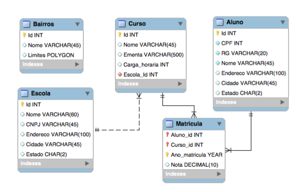

```{r setup, include=FALSE}
knitr::opts_chunk$set(echo = TRUE)
```

Exercício 03) O diagrama relacional da Figura 1 é formado por 5 tabelas:

- (1) Bairros: contém os nomes e os limites dos bairros de um município (PK: Id); 
- (2) Escola: contém algumas escolas desse município (PK: Id); 
- (3) Curso: contém os cursos oferecidos pelas escolas (PK: Id); 
- (4) Aluno: contém os registros dos alunos (PK: Id); 
- (5) Matricula: associa alunos a cursos, ou seja, quais cursos cada aluno cursou, em qual ano e qual foi sua nota (PK: Aluno_id, Curso_id e Ano_matricula). 

```{r fig1, echo = FALSE, fig.align = "center", fig.cap="Diagrama relacional", out.width = '60%'}

```

Baseado nesse diagrama, responda as perguntas abaixo.

\newpage

1)Em um modelo relacional, o que é restrição de integridade referencial ?

O conceito de integridade referêncial está relacionado aos relacionamentos entre as tabelas, onde, a chave estrangeira de uma tabela é, em alguma outra tabela, uma chave primária. Tal conceito é utilizado para manter a consistência de ambas as tabelas envolvidas na relação.

2)Indique  quais  são  as  chaves  estrangeiras  (*Foreign Keys*)  do  diagrama  da Figura 1 e quais colunas e tabelas elas associam.

As associações identificadas nestre trabalho são apresentadas abaixo.

| Tabela de origem 	| Chave estrangeira 	| Tabela(s) associada(s) 	|
|:----------------:	|:-----------------:	|------------------------	|
|     Matricula    	|      Aluno_id     	| Aluno(id)              	|
|     Matrícula    	|      Curso_id     	| Curso(id)              	|
|       Curso      	|     Escola_id     	| Escola(id)             	|

3)A tabela `Matricula` pode conter matrículas de um mesmo aluno em um mesmo curso mais de uma vez? Por que?

Para a solução deste exercício, duas respostas foram identificadas. A primeira é feita considerando que os valores da chave `Ano_matricula` sempre serão diferentes (Uma matricula por ano, por exemplo), então, neste caso a resposta é `sim`, uma vez que como a chave primária da tabela é composta, quando um dos valores muda a chave é diferente das demais. Porém, ao considerar que o valor de `Ano_matricula` pode se repetir, então, a resposta passa a ser não, e a lógica para isto é a mesma apresentada anteriormente.

04)Se  todas  as  chaves  estrangeiras  do  diagrama  forem  criadas  com  a  ação “ON DELETE CASCADE” e “ON UPDATE CASCADE”, o que acontece se:

- a. Eu remover o curso “XXX” da tabela Curso ? \newline
    R: Os elementos de todas as tabelas que fazem referência para o curso "XXX" serão removidos

- b. Eu  alterar o nome do curso “XXX” para “YYY” na tabela Curso ? \newline
    R: Considerando que as demais tabelas fazem referência somente ao `id` da tabela curso, não ocorre mais mudanças que não a do valor "XXX" para "YYY", mantendo todas as demais relações iguais.

- c. Eu remover o aluno “ZZZZ” da tabela Aluno ? \newline
    R: Ao remover o aluno "ZZZZ", os registro presentes da tabela matrícula que fazem referência a este aluno serão excluídos.
  
- d. Eu remover a escola “EEEE” da tabela Escola ? \newline
    R: Ao remover a escola "EEEE", os registros que fazem referência a este da tabela Curso serão removidos, o que causa também a remoção dos elementos da tabela matrícula relacionados aos excluídos da tabela curso.

- e. Eu alterar o ano de uma matricula (Ano_matricula) da tabela Matricula ? \newline
    R: Como o atributo `Ano_matricula` é uma chave primária que nenhuma outra tabela faz referência, a modificação apenas altera o valor do registro.

- f. Eu alterar o id do curso de um aluno (Curso_id) da tabela Matricula ? \newline
    R: A troca será feita, desde que, haja na tabela curso um registro com o `id` indicado.

5)Cada turma, que é composta pelos alunos que se matricularam em um mesmo curso em um mesmo ano, elege um aluno representante para participar de reuniões com a diretoria das escolas. Como você incluiria essa informação no diagrama da Figura 1?

<!-- Aqui uma entidade fraca poderia ser criada, sendo esta dependente do número de matrícula do representante.... -->

<!-- ToDo: Rever depois de finalizar a lista 2 (Aqui sua mente vai estar mais familiarizada com o SQL) -->
<!-- Esse era meu pensamento inicial: Para resolver este problema uma tabela Representante poderia ser criada, nesta as entradas podem ser o id da matrícula  -->

6)Quais recursos de um SGBD você usaria para implementar as restrições abaixo (descreva qual o recuso, como ele funciona e como seria implementado – sobre quais tabelas e colunas):

a. As notas dos alunos nos cursos devem ser entre zero e dez

A solução apresentada deste exercício é feita considerando que as mudanças poderia ser feitas na definição da tabela, porém, o mesmo processo poderia ser aplicado em tabelas já existentes, através dos comandos `ALTER TABLE`, vistos em sala de aula.

Para solucionar este exercício, é possível utilizar a constraint `CHECK`, que verifica condições arbitrárias, definidas no momento de sua definição, indicando que um registro pode ou não ser salvo no banco de dados. Neste caso, tal constraint pode ser adicionada diretamente na coluna nota da tabela Matricula, verificando a necessidade da nota estar entre o intervalo $[0, 10]$.

Um exemplo é apresentado abaixo. \newline

```sql
CREATE TABLE Matricula
(
  -- Comandos omitidos
	nota DECIMAL(10) CHECK(nota >= 0 AND nota <= 10)
  -- Comandos omitidos
)
```

b. Não podem existir 2 ou mais alunos com o mesmo RG \newline

Da mesma forma que o exercício anterior, aqui é considerado uma alteração na criação da tabela, porém tal modificação poderia ser aplicada em tabelas já existentes. A constraint aplicada para a solução deste problema é a `UNIQUE`, que garante a unicidade dos valores das colunas marcadas. Para este caso, seu uso seria feito na coluna RG da tabela Aluno, como apresentado abaixo. \newline

```sql
CREATE TABLE Aluno
(
  -- Comandos omitidos
  RG VARCHAR(20) UNIQUE
  -- Comandos omitidos
)
```

c. Um aluno só pode estar matriculado em no máximo 3 cursos distintos em um mesmo ano \newline

Para a solução deste exercício, a funcionalidade de trigger pode ser aplicada. Para isso, a trigger é criada e vinculada a tabela de matrícula, sendo configurada para funcionar antes de qualquer inserção. No corpo da função a ser executada pela trigger, é feita a verificação da quantidade de cursos que o `id` identificado na nova inserção está associado, emitindo um erro caso este valor seja acima de três.
